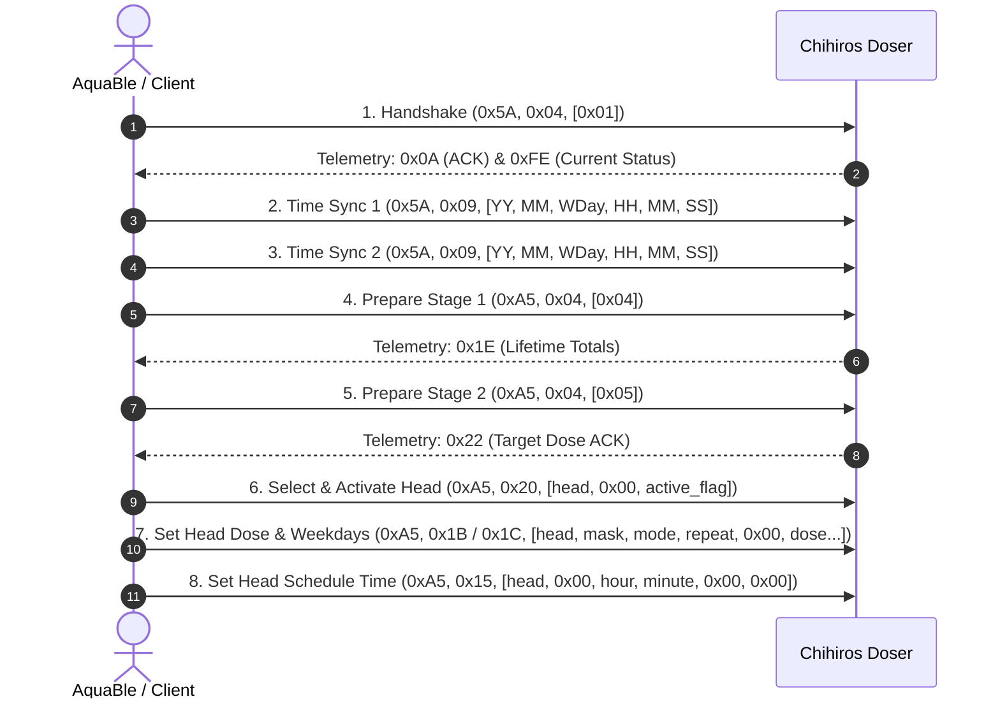

# Chihiros Bluetooth Protocol Specification

These notes describe the application-level BLE protocol used by Chihiros aquarium devices, including LED lighting systems, multi-head dosing pumps, and accessories (Doctor steriliser). They are based on the working implementation in AquaBle, reverse-engineering analyses of official Chihiros applications (Chihiros Magic and My Chihiros Flutter apps), and captured BLE packet traces.

---

## 1. BLE Transport & GATT Architecture

Chihiros devices communicate over Bluetooth Low Energy (BLE) using a Nordic UART Service (NUS) profile:

| Characteristic / Descriptor | UUID | Properties | Description |
| :--- | :--- | :--- | :--- |
| **UART Service** | `6e400001-b5a3-f393-e0a9-e50e24dcca9e` | — | Primary GATT service |
| **Write / RX Characteristic** | `6e400002-b5a3-f393-e0a9-e50e24dcca9e` | `WRITE` / `WRITE NO RESP` | Inbound command channel (app to device) |
| **Notify / TX Characteristic**| `6e400003-b5a3-f393-e0a9-e50e24dcca9e` | `NOTIFY` | Outbound telemetry channel (device to app) |
| **CCCD** | `00002902-0000-1000-8000-00805f9b34fb` | `READ` / `WRITE` | Client Characteristic Configuration Descriptor |

Legacy app versions also reference alternative GATT characteristics:

| Legacy Purpose | UUID |
| :--- | :--- |
| **Legacy Write/Notify Characteristic** | `0000ffe1-0000-1000-8000-00805f9b34fb` |
| **Legacy AT Characteristic** | `0000ffab-0000-1000-8000-00805f9b34fb` |

### Connection Prelude & MTU
1. **MTU Exchange**: The client typically negotiates an MTU of 247 bytes (`Exchange MTU Request -> MTU 247`).
2. **Enable Notifications**: The client enables notifications on the TX characteristic by writing `0x01 0x00` to the CCCD handle.
3. **Command Transmission**: Application commands are written to the RX characteristic (`6e400002-...`).
4. **Telemetry Reception**: Status updates, query acknowledgements, and periodic telemetry notifications arrive asynchronously on the TX characteristic (`6e400003-...`).

---

## 2. Device Discovery & Advertised Name Prefixes

Chihiros devices broadcast their model identity in their BLE advertisement name. AquaBle matches devices using the following prefix registry:

| Prefix | Commercial Model Name | Device Type | Channel Layout / Notes |
| :--- | :--- | :--- | :--- |
| `DYDOS` / `DYDOSE` | Chihiros Dosing Pump | Doser | 4 independent peristaltic pump heads |
| `DYWPRO30` .. `DYWPRO90`, `DYWPR120`, `DYWPR` | WRGB II Pro | Light | 4 channels: Red (0), Green (1), Blue (2), White (3) |
| `DYNA2`, `DYNA2N`, `DYNA` | A II Series | Light | 1 channel: White (0) |
| `DYSILN`, `DYSIL`, `DYSL` | WRGB II Slim | Light | 3 channels: Red (0), Green (1), Blue (2) |
| `DYSSD`, `DYZSD` | Z Light TINY | Light | 2 channels: White (0), Warm White (1) |
| `DYNCRGP` | C II RGB | Light | 3 channels: Red (0), Green (1), Blue (2) |
| `DYNC2N`, `DYNC2` | C II | Light | 1 channel: White (0) |
| `DYDD` | Tiny Terrarium Egg | Light | 2 channels: Red (0), Green (1) |
| `DYNWRGB`, `DYNW30` .. `DYNW90`, `DYNW12P`, `DYNW`, `DYNT90` | WRGB II | Light | 3 channels: Red (0), Green (1), Blue (2) |
| `DYU550` .. `DYU1500`, `DYU` | Universal WRGB | Light | 4 channels: Red (0), Green (1), Blue (2), White (3) |
| `DYLED` | Commander 4 | Light | 3 channels: White/Red (0), Green (1), Blue (2) |
| `DYCOM` | Commander 1 | Light | 1 channel: White (0) |
| `DYVVD3` | WRGB VIVID III | Light | 4 channels: Red (0), Green (1), Blue (2), White (3); Fan telemetry & speed control |

---

## 3. General Frame Format & Preamble

All commands sent to the device and responses received from the device follow a structured binary UART framing convention.

### Transmitted Commands (`0x5A` or `0xA5` Preamble)

| Offset | Field | Type | Description |
| :---: | :--- | :---: | :--- |
| `0` | **Command ID / Family** | `uint8` | `0x5A` (90) for status, time, and basic light commands; `0xA5` (165) for schedules, doser configs, and doctor commands; `0x5F` (95) for extended commands. |
| `1` | **TX Marker** | `uint8` | Fixed `0x01` for transmitted commands. |
| `2` | **Length Byte (`len`)** | `uint8` | Number of parameter bytes + 5 (equivalent to total frame length minus 2). |
| `3` | **Message ID High (`count_hi`)** | `uint8` | High byte of the incrementing sequence counter. |
| `4` | **Message ID Low (`count_lo`)** | `uint8` | Low byte of the incrementing sequence counter. |
| `5` | **Mode / Sub-command** | `uint8` | Function-specific mode byte (e.g. `0x04`, `0x07`, `0x09`, `0x15`, `0x19`, `0x1B`, `0x20`). |
| `6 .. n-2` | **Parameters / Payload** | `bytes` | Command-specific parameter bytes (e.g. head index, datetime, brightness, dose volume). |
| `n-1` | **Verification / Checksum** | `uint8` | 8-bit XOR checksum over bytes `1` through `n-2`. |

Total frame length is `len(parameters) + 7` bytes.

### Received Telemetry / Responses (`0x5B` Preamble)

Responses sent as BLE notifications from the device adopt the `0x5B` header:

| Offset | Field | Type | Description |
| :---: | :--- | :---: | :--- |
| `0` | **Response Prefix** | `uint8` | Fixed `0x5B` (91). |
| `1` | **Protocol / Version** | `uint8` | Firmware / protocol version identifier (e.g. `0x01`, `0x06`, `0x17`, `0x1B`). |
| `2` | **Payload Length** | `uint8` | Length of payload + header fields. |
| `3 .. 4` | **Message ID Echo** | `uint16_be` | Echoes the sequence message ID. |
| `5` | **Response Mode** | `uint8` | Identifies notification structure (`0x0A` = ACK/battery, `0xFE` = Schedule snapshot, `0x1E` = Lifetime totals, `0x0B` = Fan telemetry, `0x22` = Target ACK). |
| `6 .. n-2` | **Payload Body** | `bytes` | Telemetry or configuration payload. |
| `n-1` | **Trailer / Checksum** | `uint8` | XOR checksum (or opaque status byte depending on response mode). |

---

## 4. Message IDs, Reserved Values & Checksum Validation

### Message ID Sequencing & Sanitisation Rules
1. **Reserved Value `0x5A` (90)**:
   - In Chihiros UART framing, `0x5A` is the primary frame start indicator. To prevent framing desynchronisation, `0x5A` is strictly avoided in sequence counters, payload data, and checksums.
2. **Sequence Increment**:
   - Initial message ID begins at `(0, 1)`.
   - When incrementing the lower byte, if `msg_lo == 89` (`0x59`), the counter skips `90` directly to `91` (`0x5B`).
   - When `msg_lo == 255`, `msg_lo` wraps to `0` and `msg_hi` increments.
   - When incrementing the higher byte, if `msg_hi == 89`, it skips `90` to `91`.
   - Complete exhaustion (`255, 255`) wraps back to `(0, 1)`.
3. **Payload Sanitisation**:
   - Any parameter byte in the payload evaluating to `0x5A` is replaced with `0x59`.
4. **Checksum Collision Prevention**:
   - If the calculated XOR checksum evaluates to `0x5A`, the client must increment the message ID and re-encode the entire frame.

### Checksum Algorithm
The checksum is an 8-bit XOR over all frame bytes starting at index 1 (Length byte) up to and including the last parameter byte `n-2` (excluding the frame start byte at index 0):

$$\text{Checksum} = \bigoplus_{i=1}^{n-2} \text{Byte}[i]$$

Python implementation:
```python
def calculate_checksum(frame_without_checksum: bytes | bytearray) -> int:
    """Calculate the verification byte for an encoded command.
    
    Excludes byte 0 (0x5A / 0xA5) and XORs bytes 1 through n-2.
    """
    assert len(frame_without_checksum) >= 6
    checksum = frame_without_checksum[1]
    for b in frame_without_checksum[2:]:
        checksum ^= b
    return checksum & 0xFF
```

---

## 5. Common System Commands

### Set Device Clock / Time Sync (`0x5A / 0x09`)
Synchronises device RTC. Sent during connection establishment and prior to schedule writes.

- **Command ID**: `0x5A` (90)
- **Mode**: `0x09` (9)
- **Parameters** (6 bytes): `[year - 2000, month, weekday, hour, minute, second]`

| Parameter Offset | Field | Description | Valid Range |
| :---: | :--- | :--- | :--- |
| `0` | `year - 2000` | Two-digit year offset (e.g. `26` for 2026) | `0 .. 99` |
| `1` | `month` | Month of year | `1 .. 12` |
| `2` | `weekday` | ISO weekday | `1` (Monday) .. `7` (Sunday) |
| `3` | `hour` | Hour of day (24-hour) | `0 .. 23` |
| `4` | `minute` | Minute of hour | `0 .. 59` |
| `5` | `second` | Second of minute | `0 .. 59` |

Captured frame example:
```text
5A 01 0B 00 07 09 1A 08 04 0B 1E 0F 33
```
*Decodes as: Length `0x0B`, Msg ID `0x0007`, Mode `0x09`, Date `2026-08-27 (Thursday) 11:30:15`, Checksum `0x33`.*

### Weekday 7-Bit Bitmask
Both LED lights and dosing pumps use an identical 7-bit bitmask to configure active recurrence days:

| Weekday | Bit Position | Bitmask Value (Hex) | Bitmask Value (Decimal) |
| :--- | :---: | :---: | :---: |
| **Monday** | Bit 6 | `0x40` | `64` |
| **Tuesday** | Bit 5 | `0x20` | `32` |
| **Wednesday** | Bit 4 | `0x10` | `16` |
| **Thursday** | Bit 3 | `0x08` | `8` |
| **Friday** | Bit 2 | `0x04` | `4` |
| **Saturday** | Bit 1 | `0x02` | `2` |
| **Sunday** | Bit 0 | `0x01` | `1` |
| **Everyday (All days)** | Bits 0–6 | `0x7F` | `127` |

*Example: Monday + Wednesday + Friday = $64 + 16 + 4 = 84$ (`0x54`).*

---

## 6. LED Light Protocol

### Manual Channel Brightness (`0x5A / 0x07`)
Sets the instantaneous PWM brightness level of an individual colour channel:

- **Command ID**: `0x5A` (90)
- **Mode**: `0x07` (7)
- **Parameters**: `[channel_id, brightness_level]`
  - `channel_id`: `0` (Red / Main White), `1` (Green / Warm White), `2` (Blue), `3` (Dedicated White).
  - `brightness_level`: `0` to `100` (percentage). Multi-channel fixtures require sequential commands per channel.

Captured frame for Channel 0 at 100% (`0x64`):
```text
5A 01 07 00 20 07 00 64 45
```

### Auto Mode & Preset Switching (`0x5A / 0x05`)
Switches operational light mode or resets configuration:

- **Command ID**: `0x5A` (90)
- **Mode**: `0x05` (5)
- **Parameters**: `[action_code, 255, 255]`

| Action Code | Function | Description |
| :---: | :--- | :--- |
| `18` (`0x12`) | **Enable Auto Mode** | Activates hardware schedule execution. |
| `5` (`0x05`) | **Reset Auto Settings** | Clears all programmed schedules on the fixture. |
| `11` (`0x0B`) | **Manual Setup Mode** | Sent before slider control; switches light to manual PWM state. |
| `4` (`0x04`) | **Stop / Exit Demo** | Exits demo sequence (legacy app). |
| `6` (`0x06`) | **Start Demo** | Runs hardware ramp demonstration. |

### Auto Schedule Configuration (`0xA5 / 0x19`)
Programs an automatic daylight ramp schedule into the device microcontroller. Devices support up to 24 stored schedule blocks (though standard app setups limit to 7):

- **Command ID**: `0xA5` (165)
- **Mode**: `0x19` (25)
- **Length**: `0x13` (19 bytes total frame, 14 bytes parameter payload)
- **Parameters** (14 bytes):
  `[sunrise_h, sunrise_m, sunset_h, sunset_m, ramp_up_mins, weekday_mask, ch0, ch1, ch2, ch3, 255, 255, 255]`

| Parameter Offset | Field | Description |
| :---: | :--- | :--- |
| `0` | `sunrise_hour` | Start hour of sunrise ramp (`0 .. 23`) |
| `1` | `sunrise_minute` | Start minute of sunrise ramp (`0 .. 59`) |
| `2` | `sunset_hour` | Start hour of sunset ramp-down (`0 .. 23`) |
| `3` | `sunset_minute` | Start minute of sunset ramp-down (`0 .. 59`) |
| `4` | `ramp_up_minutes` | Duration of ramp up/down in minutes (`0 .. 150`) |
| `5` | `weekday_mask` | 7-bit weekday mask (`127` = everyday) |
| `6` | `channel_0` | Peak brightness for Channel 0 (Red / White) (`0 .. 100`) |
| `7` | `channel_1` | Peak brightness for Channel 1 (Green / Warm) (`0 .. 100` or `255` if unused) |
| `8` | `channel_2` | Peak brightness for Channel 2 (Blue) (`0 .. 100` or `255` if unused) |
| `9` | `channel_3` | Peak brightness for Channel 3 (White) (`0 .. 100` or `255` if unused) |
| `10 .. 12` | `padding` | Padding bytes, fixed to `0xFF` (`255`) to fill 7 brightness slots |

#### Schedule Deletion
To delete a schedule slot, transmit the identical timing metadata with all channel and padding slots populated with `0xFF` (8 trailing `0xFF` bytes):
```text
A5 01 13 00 17 19 02 1E 05 0A 01 7F FF FF FF FF FF FF FF FF 71
```

### Fan Control & Telemetry (`DYVVD3` / WRGB VIVID III)
- **Set Fan Speed**: `0x5A / 0x0F / [speed_percent]` (`0 .. 100`).
- **Periodic Status Notification (`0x5B / 0x0B`)**:
  Broadcast roughly every 3 seconds:
  ```text
  5B 1B 10 00 01 0B 02 58 19 00 01 00 00 00 00 00 48 22
  ```
  - Offset `1`: Firmware version (`0x1B` = 27)
  - Offsets `6..7`: Big-endian fan RPM (`0x0258` = 600 RPM at 25%, ~1980 RPM at 100%)
  - Offset `8`: Fixture temperature in whole °C (`0x19` = 25 °C)
  - Offset `16`: Monotonic uptime counter

### Light Status Telemetry (`0x5B / 0xFE`)
Returned in response to a status query (`0x5A / 0x04 / [0x01]`):
- **Header**: `5B [version] [len] [msg_hi] [msg_lo] FE [weekday] [hour] [minute]`
- **Schedule Blocks**: Array of 13-byte schedule records:
  `[sunrise_h, sunrise_m, sunset_h, sunset_m, ramp_up, weekday_mask, ch0, ch1, ch2, ch3, 0xFF, 0xFF, 0xFF]`
- **Trailer**: 5-byte hardware status tail.

---

## 7. Dosing Pump (Doser) Protocol

The Chihiros Doser series features 4 independently controlled peristaltic pump heads (indexed `0` to `3` in protocol bytes, exposed as heads `1` to `4` in user interfaces).

### Doser Connection & Schedule Configuration Workflow (8-Step Sequence)
When writing a new daily dosing schedule to a pump head, the official application transmits an 8-command sequential pipeline:



#### Step 1: Handshake Query (`0x5A / 0x04`)
- Frame: `5A 01 06 [msg_hi] [msg_lo] 04 01 [chk]`
- Triggers immediate transmission of `0x0A` (Handshake ACK) and `0xFE` (Full head status).

#### Steps 2 & 3: Double Time Sync (`0x5A / 0x09`)
- Frames: `5A 01 0B [msg_hi] [msg_lo] 09 [YY-2000, MM, WDay, HH, MM, SS] [chk]`
- Synchronises hardware RTC with confirmation duplicate.

#### Step 4: Configuration Prepare Stage 1 (`0xA5 / 0x04 / [0x04]`)
- Frame: `A5 01 06 [msg_hi] [msg_lo] 04 04 [chk]`
- Arms MCU for non-volatile write operations; triggers `0x1E` notification (Lifetime totals).

#### Step 5: Configuration Prepare Stage 2 (`0xA5 / 0x04 / [0x05]`)
- Frame: `A5 01 06 [msg_hi] [msg_lo] 04 05 [chk]`
- Finalises write authorisation; triggers `0x22` notification.

#### Step 6: Head Selection & Activation (`0xA5 / 0x20`)
- Frame: `A5 01 08 [msg_hi] [msg_lo] 20 [head_index] 00 [active_flag] [chk]`
- `head_index`: `0` to `3` (Head 1 to 4).
- `active_flag`: `0x01` (Enabled / Active), `0x00` (Disabled).

#### Step 7: Head Dose Volume & Recurrence (`0xA5 / 0x1B` or `0x1C`)
- **Standard Mode `0x1B` (Volumes $\le 25.5\text{ mL}$ / 255 tenths)**:
  `A5 01 0B [msg_hi] [msg_lo] 1B [head_index] [weekday_mask] 01 01 00 [volume_tenths_ml] [chk]`
- **Extended Mode `0x1C` (Volumes $> 25.5\text{ mL}$ up to $6553.5\text{ mL}$)**:
  `A5 01 0C [msg_hi] [msg_lo] 1C [head_index] [weekday_mask] 01 01 00 [volume_hi] [volume_lo] [chk]`
  - `volume_tenths_ml`: Volume in tenths of a millilitre (e.g. $5.0\text{ mL} = 50 = \text{0x32}$).

#### Step 8: Head Daily Schedule Time (`0xA5 / 0x15`)
- Frame: `A5 01 0B [msg_hi] [msg_lo] 15 [head_index] 00 [hour] [minute] 00 00 [chk]`
- `hour`: `0 .. 23`, `minute`: `0 .. 59`.

---

### Manual Immediate Dose (`0xA5 / 0x1B`)
Triggers an immediate one-shot dispensing run on a specific pump head without affecting saved schedules:

- **Command ID**: `0xA5` (165)
- **Mode**: `0x1B` (27)
- **Parameters** (5 bytes): `[head_index, 0x00, 0x00, volume_high, volume_low]`

$$\text{volume\_tenths\_ml} = \text{round}(\text{volume\_ml} \times 10)$$
$$\text{volume\_high} = \lfloor \text{volume\_tenths\_ml} / 256 \rfloor, \quad \text{volume\_low} = \text{volume\_tenths\_ml} \pmod{256}$$

Example for Head 0 dispensing $2.0\text{ mL}$ (20 tenths $\rightarrow \text{high}=0, \text{low}=20$):
```text
A5 01 0A 00 06 1B 00 00 00 00 14 02
```

---

### Doser Telemetry & Status Decoding

#### 1. Handshake ACK & Battery Status (`0x5B / 0x0A`)
Returned following `0x5A / 0x04`:
- Frame: `5B 06 0A [msg_hi] [msg_lo] 0A 01 FF FF FF 64 13 88 [chk]`
- Reports hardware protocol version (`0x06`), battery level (`0x64` = 100%), and internal clock counter.

#### 2. Head Schedule & Daily Dosed Snapshot (`0x5B / 0xFE` - 50 Bytes)
Pushed on initial connection; contains live daily totals, scheduled execution times, and operating modes:

```text
5B 06 30 00 01 FE 05 16 2B [Head 1..4 Blocks (36 bytes)] [Tail (5 bytes)] [chk]
```

- Byte `0`: `0x5B`
- Byte `1`: Version (`0x06`)
- Byte `2`: Length (`0x30` / 48 bytes)
- Bytes `3..4`: Sequence Message ID
- Byte `5`: Response Mode `0xFE`
- Byte `6`: Device RTC Weekday (`1` = Monday .. `7` = Sunday)
- Byte `7`: Device RTC Hour (`0 .. 23`)
- Byte `8`: Device RTC Minute (`0 .. 59`)
- **Bytes `9 .. 44`**: **4 Head Snapshot Blocks (9 bytes per head)**:
  - Offset `0`: **Operational Mode**:
    - `0x00`: `Daily` / `Single`
    - `0x01`: `24h` / `Hourly`
    - `0x02`: `Custom periods`
    - `0x03`: `Timer`
    - `0x04`: `Disabled`
  - Offset `1`: Scheduled execution hour (`0 .. 23`)
  - Offset `2`: Scheduled execution minute (`0 .. 59`)
  - Offsets `3..6`: 4 bytes auxiliary schedule metadata / interval flags
  - Offsets `7..8`: Big-endian **Volume dosed today in tenths of a mL** (`(byte7 << 8) | byte8`)
- **Bytes `45 .. 49`**: **5-Byte Status Tail**:
  - Offsets `45..48`: Target dose volume in tenths of a mL for Heads 1 to 4 (1 byte per head)
  - Offset `49`: Hardware tail status flag

#### 3. Lifetime Total Volume Dosed (`0x5B / 0x1E` - 15 Bytes)
Pushed in response to Prepare Stage 1 (`0xA5 / 0x04 / [0x04]`):

```text
5B 01 0A 00 01 1E 76 57 27 2E 62 84 54 83 5E
```

- Byte `0`: `0x5B`
- Byte `1`: Version (`0x01`)
- Byte `2`: Length (`0x0A` / 10 bytes)
- Bytes `3..4`: Sequence Message ID
- Byte `5`: Response Mode `0x1E`
- Bytes `6..13`: **4 $\times$ 16-bit Big-Endian Unsigned Integers** representing cumulative lifetime dosed volume in tenths of a mL:
  - Head 1: `(byte[6] << 8) | byte[7]`
  - Head 2: `(byte[8] << 8) | byte[9]`
  - Head 3: `(byte[10] << 8) | byte[11]`
  - Head 4: `(byte[12] << 8) | byte[13]`
- Byte `14`: XOR Checksum

---

## 8. Chihiros Command Encoding Reference Log

Annotated packet trace from reverse engineering captures:

### Configuration Commands (`A5 01` Prefix)

| # | Length (`len`) | Count (`msg_id`) | Mode | Decoded Payload Bytes | Checksum | Description / Function |
| :-: | :---: | :---: | :---: | :--- | :---: | :--- |
| **1** | `08` | `000C` | `20` | `00`(Head 1) `00` `01`(Active) | `24` | Select Head 1 & mark active |
| **2** | `0B` | `000D` | `1B` | `00`(Head 1) `7F`(Everyday) `0101 00` `32`(5.0 mL) | `51` | Set Head 1 dose: 5.0 mL daily |
| **3** | `0B` | `000E` | `15` | `00`(Head 1) `00` `0738`(07:56) `0000` | `2E` | Set Head 1 schedule time: 07:56 |
| **4** | `08` | `0010` | `20` | `01`(Head 2) `00` `01`(Active) | `39` | Select Head 2 & mark active |
| **5** | `0B` | `0011` | `1B` | `01`(Head 2) `7F`(Everyday) `0101 00` `32`(5.0 mL) | `4C` | Set Head 2 dose: 5.0 mL daily |
| **6** | `0B` | `0012` | `15` | `01`(Head 2) `00` `083A`(08:58) `0000` | `3E` | Set Head 2 schedule time: 08:58 |
| **7** | `08` | `0014` | `20` | `02`(Head 3) `00` `00`(Disabled) | `3F` | Select Head 3 & disable schedule |
| **8** | `0B` | `0015` | `1B` | `02`(Head 3) `3F`(Mon-Sat) `0101 00` `28`(4.0 mL) | `11` | Set Head 3 dose: 4.0 mL (inactive) |
| **9** | `08` | `0017` | `20` | `00`(Head 1) `00` `01`(Active) | `3F` | Re-select Head 1 |
| **10** | `0B` | `0018` | `1B` | `00`(Head 1) `7F`(Everyday) `0101 00` `32`(5.0 mL) | `44` | Update Head 1 dose |
| **11** | `0B` | `0019` | `15` | `00`(Head 1) `00` `0838`(08:56) `0000` | `36` | Update Head 1 time to 08:56 |
| **12** | `08` | `001B` | `20` | `03`(Head 4) `00` `01`(Active) | `30` | Select Head 4 & mark active |
| **13** | `0B` | `001C` | `1B` | `03`(Head 4) `7F`(Everyday) `0101 00` `3C`(6.0 mL) | `4D` | Set Head 4 dose: 6.0 mL daily |
| **14** | `0B` | `001D` | `15` | `03`(Head 4) `00` `083B`(08:59) `0000` | `32` | Set Head 4 schedule time: 08:59 |

### System Telemetry & Clock Writes (`5A 01` Prefix)

| # | Length (`len`) | Count (`msg_id`) | Mode | Decoded Payload Bytes | Checksum | Target Device |
| :-: | :---: | :---: | :---: | :--- | :---: | :--- |
| **1** | `0B` | `0007` | `09` | `19 09 07 11 07 20` (2025-09-07 Sun 17:07:32) | `25` | Doser Time Sync |
| **2** | `0B` | `0008` | `09` | `19 09 07 11 07 20` (2025-09-07 Sun 17:07:32) | `2A` | Doser Time Sync (Confirm) |
| **3** | `0B` | `0009` | `09` | `19 09 02 0A 00 19` (2025-09-02 Tue 10:00:25) | `0B` | LED Light Time Sync |
| **4** | `0B` | `000A` | `09` | `19 09 02 0A 00 19` (2025-09-02 Tue 10:00:25) | `08` | LED Light Time Sync (Confirm) |

---

## 9. Doctor & Accessory Commands

The Chihiros Doctor (algae inhibitor / steriliser) uses family code `0xA5`:

| Command ID | Mode | Parameters | Description |
| :---: | :---: | :--- | :--- |
| `0xA5` (165) | `0x01` (1) | `[duration_hi, duration_lo]` | Sets operation duration as big-endian 16-bit seconds. |
| `0xA5` (165) | `0x02` (2) | `[1]` | Doctor power ON. |
| `0xA5` (165) | `0x02` (2) | `[2]` | Doctor power OFF. |
| `0xA5` (165) | `0x02` (2) | `[3]` | Query Doctor runtime / telemetry status. |

---

## 10. Summary of Command Families & Modes

| Family / Header | Mode (Hex) | Mode (Dec) | Direction | Application / Function |
| :---: | :---: | :---: | :---: | :--- |
| `0x5A` | `0x04` | 4 | Host $\rightarrow$ Device | Query device status / handshake (`[0x01]`). |
| `0x5A` | `0x05` | 5 | Host $\rightarrow$ Device | Light preset / mode switch (`18`=Auto, `5`=Reset, `11`=Manual). |
| `0x5A` | `0x06` | 6 | Host $\rightarrow$ Device | Legacy 48-point or single-channel custom schedule point. |
| `0x5A` | `0x07` | 7 | Host $\rightarrow$ Device | Set instantaneous manual channel brightness (`[channel, level]`). |
| `0x5A` | `0x09` | 9 | Host $\rightarrow$ Device | Set device RTC clock (`[YY, MM, WDay, HH, MM, SS]`). |
| `0x5A` | `0x0F` | 15 | Host $\rightarrow$ Device | Set fan speed percentage (`[speed_percent]`). |
| `0xA5` | `0x04` | 4 | Host $\rightarrow$ Device | Doser configuration prepare / auth (`[0x04]` Stage 1, `[0x05]` Stage 2). |
| `0xA5` | `0x15` | 21 | Host $\rightarrow$ Device | Set doser head daily schedule time (`[head, 0, HH, MM, 0, 0]`). |
| `0xA5` | `0x19` | 25 | Host $\rightarrow$ Device | Add, update, or clear light auto schedule (14 parameter bytes). |
| `0xA5` | `0x1B` | 27 | Host $\rightarrow$ Device | Doser: Manual instant dose OR set head schedule volume ($\le 25.5\text{ mL}$). |
| `0xA5` | `0x1C` | 28 | Host $\rightarrow$ Device | Doser: Set head schedule volume with 2-byte encoding ($> 25.5\text{ mL}$). |
| `0xA5` | `0x20` | 32 | Host $\rightarrow$ Device | Doser: Select pump head & set active/disabled state. |
| `0x5B` | `0x0A` | 10 | Device $\rightarrow$ Host | Handshake ACK, hardware battery level, and runtime counter. |
| `0x5B` | `0x0B` | 11 | Device $\rightarrow$ Host | Fan telemetry notification (measured RPM, temperature in °C, uptime). |
| `0x5B` | `0x1E` | 30 | Device $\rightarrow$ Host | Doser lifetime total dosed volume for all 4 heads (15 bytes). |
| `0x5B` | `0x22` | 34 | Device $\rightarrow$ Host | Doser target configuration ACK. |
| `0x5B` | `0xFE` | 254 | Device $\rightarrow$ Host | Full status snapshot (Light: schedules / Doser: daily dosed & head modes). |

