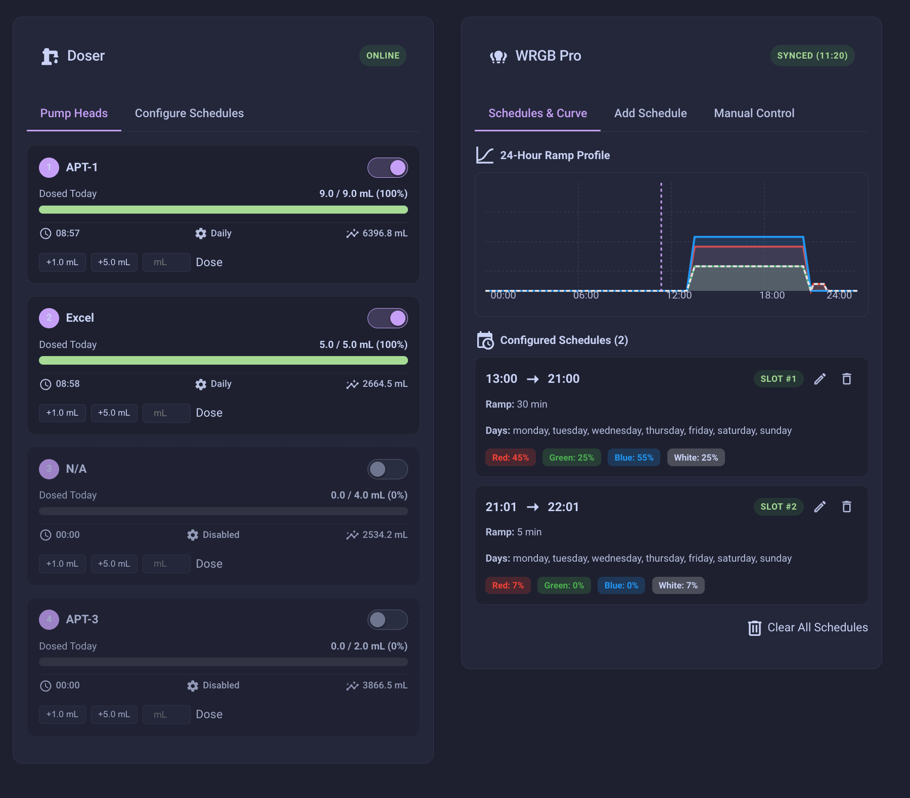
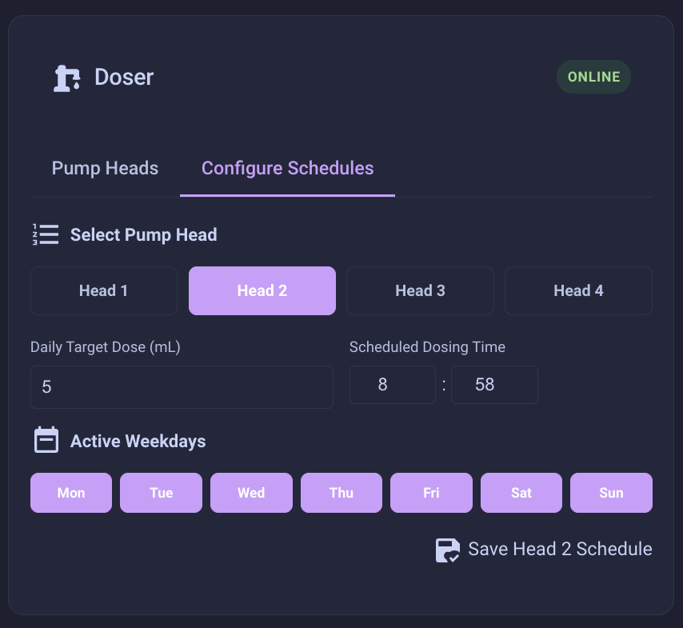
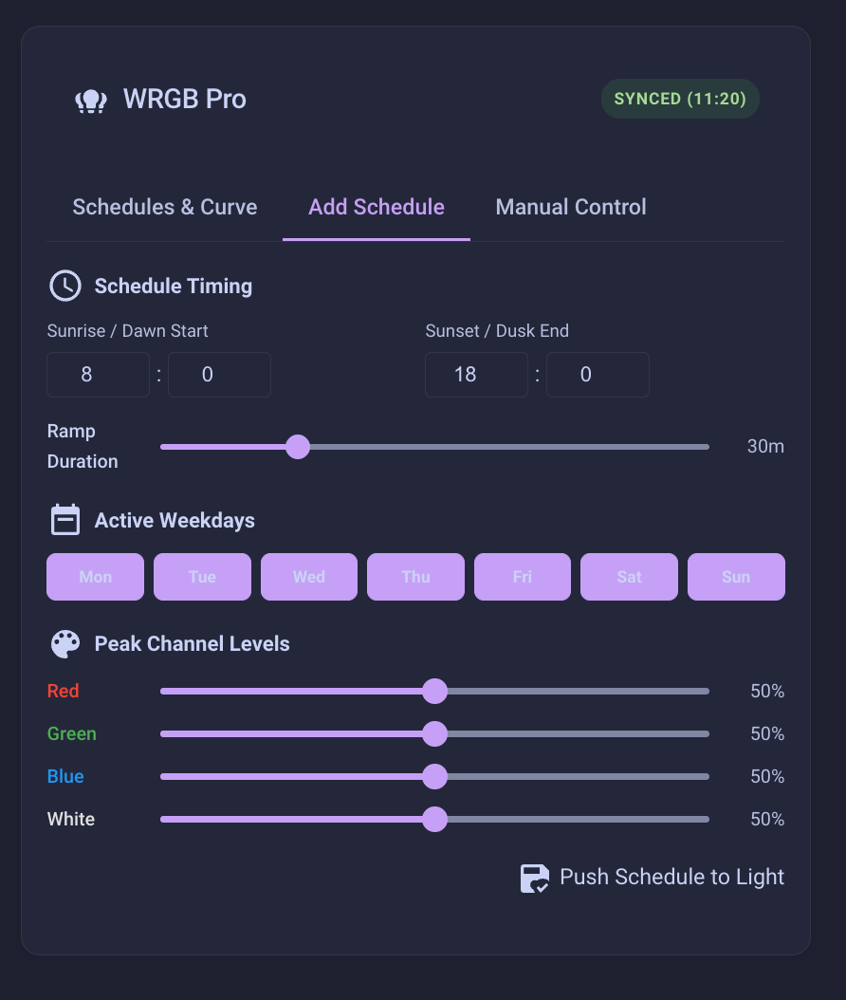
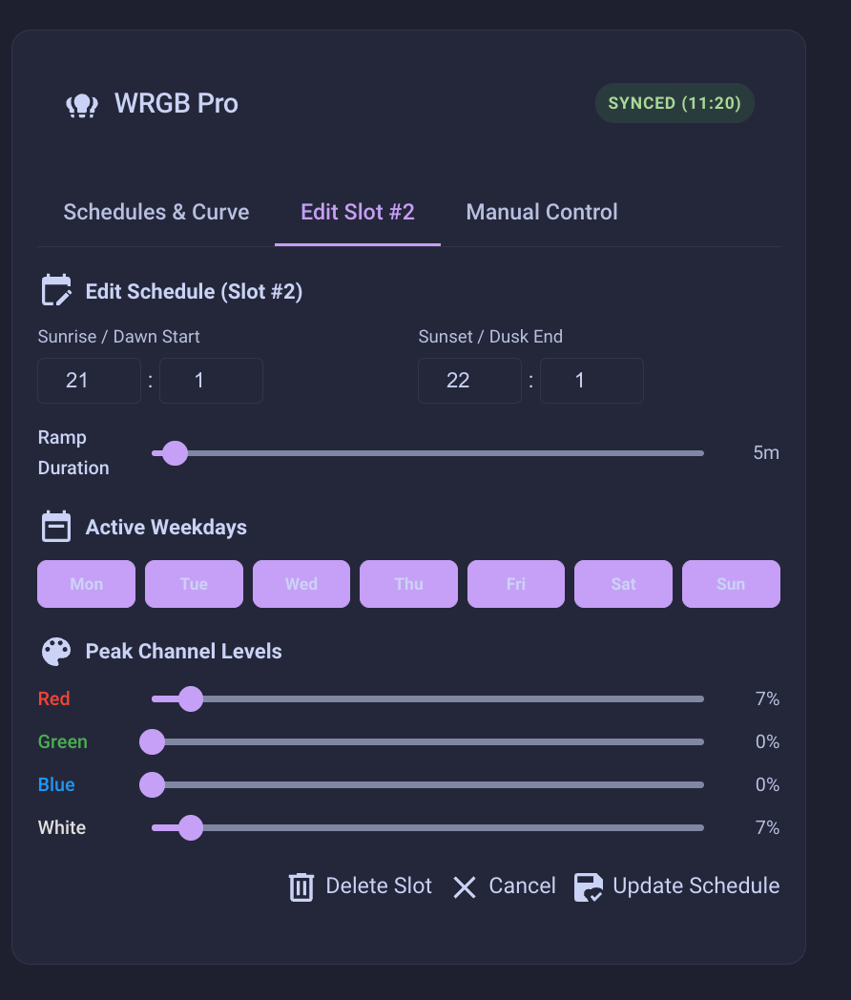
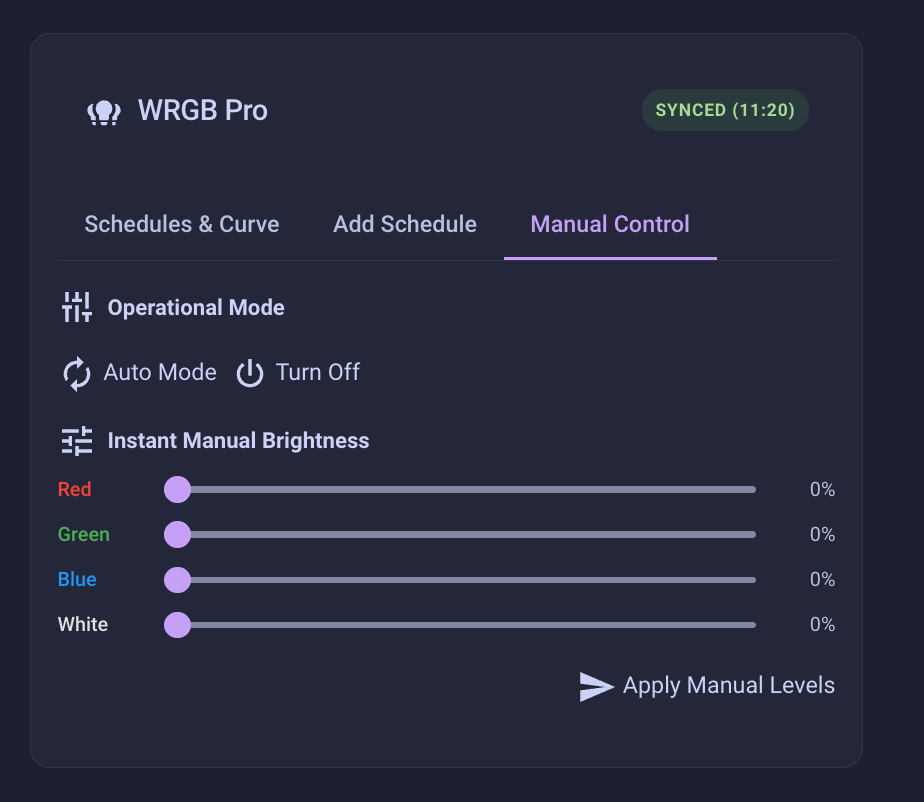

# AquaBle

**Home Assistant integration for Chihiros aquarium devices (LED lights and dosing pumps) via Bluetooth Low Energy.**

AquaBle is built on a robust, **stateless functional architecture**. Rather than attempting to force autonomous aquarium ecosystems into standard Home Assistant "on/off" switches, AquaBle treats your equipment as "set and forget" configuration targets. You can monitor equipment telemetry via real-time sensors, manage lighting and dosing routines visually via custom Lovelace cards, and push complex schedules directly to the hardware using Home Assistant Automations and Scripts.

---

*Based on [Chihiros LED Control](https://github.com/TheMicDiet/chihiros-led-control) by Michael Dietrich.*

---

## Architecture Overview

AquaBle integrates Chihiros aquarium equipment into Home Assistant over Bluetooth Low Energy (BLE) using Nordic UART Service (NUS).

```text
┌──────────────────────────────────────────────────────────────────────────────┐
│                        Home Assistant (Source of Truth)                      │
│                                                                              │
│  1. Configuration Storage (ConfigEntry Options):                             │
│     - Stores full light auto-schedule definitions (Sunrise, Sunset, Ramp,    │
│       Weekdays, Channel levels: R, G, B, W).                                 │
│                                                                              │
│  2. Real-Time Software Interpolation Engine:                                 │
│     - Computes instantaneous brightness (0–100%) per channel locally every   │
│       second without continuous BLE polling.                                 │
│                                                                              │
│  3. Custom Dashboard Cards (Lovelace):                                       │
│     - aquable-light-card: 24h interactive ramp curve visualiser & editor.    │
│     - aquable-doser-card: 4-head doser progress, targets, & manual dosing.   │
│                                                                              │
│  4. Hardware Command Dispatch & Telemetry Verification (5-Min Poll):         │
│     - Sends binary UART frames (auto-schedules, manual levels, manual dose). │
│     - Verifies device clock and hardware curve synchronisation (0xFE / 0x1E).│
└──────────────────────────────────────┬───────────────────────────────────────┘
                                       │
                                   BLE / NUS
                                       ▼
┌──────────────────────────────────────────────────────────────────────────────┐
│                            Device Hardware (Microcontroller)                 │
│  - Light: Executes compiled keyframe ramp points via PWM.                    │
│  - Doser: Tracks daily volume dispensed, schedule times, and lifetime totals.│
└──────────────────────────────────────────────────────────────────────────────┘
```

> **Protocol Details:** For low-level binary UART framing, command mode tables, XOR checksum algorithms, and packet captures, refer to [BLE_Protocol.md](BLE_Protocol.md).

---

## Features

- **Native HA Bluetooth**: Utilises Home Assistant's native Bluetooth stack, ESPHome Bluetooth Proxies, and local Bluetooth adapters with automated reconnects.
- **Interactive 24-Hour Ramp Curves**: Custom SVG curve visualiser showing sunrise, peak hold, sunset, and moonlight transitions with live time tracking.
- **Visual Schedule Management**: Add, click-to-edit, and delete individual light schedule slots or clear schedules directly from dashboard cards.
- **Autonomous Doser Scheduling**: Configure per-head targets, execution times, and weekday recurrence directly to the pump microcontroller.
- **4-Head Doser Monitoring**: Real-time progress bars showing volume dosed today versus daily target, per-head active toggles, and manual quick-dosing buttons.
- **Zero-Poll Local Interpolation**: Real-time channel brightness sensors calculated locally without battery or Bluetooth bandwidth drain.
- **Automatic Dashboard Card Registration**: Dashboard cards register automatically upon integration installation.

---

## Supported Devices

### Dosing Pumps
- **Chihiros Doser Series** (2/4-head dosing pump)

### LED Lights
- **WRGB Series**: WRGB, WRGB II, WRGB II Pro, WRGB II Slim, WRGB VIVID III
- **Commander Series**: Commander 1, Commander 4
- **Other Models**: A II, C II, C II RGB, Z-Light Tiny, Universal WRGB, Tiny Terrarium Egg

---

## Custom Dashboard Cards

AquaBle includes two purpose-built Lovelace dashboard cards designed to replace the official app experience.

| Overview | Edit Dose-head |
| --- | --- |
|  |  | 

### 1. Dosing Pump Card (`aquable-doser-card`)

A 4-head peristaltic pump dashboard featuring:
- **Live Progress Grid**: 4-head monitoring grid displaying daily dosed volume vs target volume with animated progress bars and percentage completion badges.
- **Per-Head Schedule Toggles**: Quickly enable or disable scheduled execution for any individual pump head.
- **Instant Manual Dosing**: One-tap quick dosing triggers (`+1.0 mL`, `+5.0 mL`, or custom volume inputs) with confirmation feedback.
- **Head Schedule Configuration**: Tabbed configuration editor for daily dose volume targets, schedule run times (`HH:MM`), and active weekday filters.

| Add Schedule | Edit Schedule | Manual Control |
| --- | --- | --- | 
|  |  | |

### 2. Light Schedule & Control Card (`aquable-light-card`)

A comprehensive 24-hour lighting controller featuring:
- **Interactive 24-Hour Ramp Profile**: Dynamic SVG curve rendering real-time brightness curves across all colour channels (Red, Green, Blue, White) with an animated time-of-day indicator marker line.
- **Configured Schedule Manager**: Visual list of active schedule slots displaying start/end times, ramp-up durations, active weekdays, and channel percentage pills.
- **Click-to-Edit & Delete**: Click any configured schedule card to enter edit mode, modify parameters, or delete individual schedule slots from hardware memory.
- **Schedule Timing & Peak Sliders**: Configure dawn/dusk hours, ramp duration (0–120 min), active weekday pills, and per-channel peak intensity sliders (0–100%).
- **Manual Mode & Power Control**: Instant manual channel brightness sliders and one-touch mode switching (Auto, Manual, Off).

---

## Dashboard Card Setup

AquaBle automatically registers both custom cards as Lovelace resources when the integration is installed.

### Adding Cards via the UI
1. Open your Home Assistant dashboard and click **Edit Dashboard** (top-right menu).
2. Click **+ Add Card** and search for:
   - **AquaBle Light Schedule Card** (for LED lights)
   - **AquaBle Dosing Pump Card** (for dosing pumps)
3. Select your device from the dropdown and click **Save**.

### Adding Cards via YAML

```yaml
# Light Schedule & Ramp Card
type: custom:aquable-light-card
entity: sensor.wrgb_ii_pro_active_schedules

# Dosing Pump Card
type: custom:aquable-doser-card
entity: sensor.chihiros_doser_head_1_dosed_today
```

> **Tip:** If the custom card does not appear immediately after installation, perform a hard refresh in your browser (`Ctrl+F5` or `Cmd+Shift+R`) to reload the Lovelace frontend cache.

---

## Device Telemetry & Exposed Entities

### A. Dosing Pump (`DYDOS` / `DYDOSE`)
- **Telemetry Sources**:
  - `0x0A`: Handshake acknowledgement and battery level.
  - `0xFE`: Per-head operating mode (`Daily`, `Disabled`, etc.), daily schedule run times, volume dosed today (in tenths of a mL), and target volumes.
  - `0x1E`: Lifetime total dosed volume across all 4 pump heads.
- **Exposed Entities**:
  - `sensor.<device>_head_1_dosed_today` .. `head_4_dosed_today`: Volume dispensed today (mL).
  - `sensor.<device>_head_1_target_dose` .. `head_4_target_dose`: Configured daily target (mL).
  - `sensor.<device>_head_1_schedule_time` .. `head_4_schedule_time`: Configured run time (`HH:MM`).
  - `sensor.<device>_head_1_mode` .. `head_4_mode`: Current operating mode (`daily`, `disabled`, etc.).
  - `sensor.<device>_head_1_lifetime_total` .. `head_4_lifetime_total`: Cumulative lifetime volume dispensed (mL).

### B. LED Light Devices (`DYWPR`, `DYNW`, `DYSIL`, `DYU`, etc.)
- **Telemetry & Storage Model**:
  - Home Assistant stores full schedule definitions in `ConfigEntry.options` as the source of truth.
  - Periodic BLE polling reads `0xFE` notifications to verify device clock synchronisation.
- **Exposed Entities**:
  - `sensor.<device>_active_schedules`: Reports active schedule count as state with structured schedule definitions in attributes (`sunrise`, `sunset`, `ramp_up_minutes`, `weekdays`, `channel_brightness`).
  - `sensor.<device>_hardware_sync`: Reports synchronisation state (`synced`) and internal device clock (`device_time`).
  - `sensor.<device>_channel_red_live_brightness` (and green, blue, white): Real-time interpolated brightness percentage (0–100%) updated every second.

---

## Installation

### Via HACS (Recommended)

1. Open **HACS** in your Home Assistant instance.
2. Navigate to **Integrations**.
3. Click the **⋮** menu in the top-right corner and select **Custom repositories**.
4. Add the repository URL: `https://github.com/caleb-venner/AquaBle`
5. Select category: **Integration** and click **Add**.
6. Locate **AquaBle** in the integration list and click **Download**.
7. Restart Home Assistant.

### Manual Installation

1. Download the latest release from the repository.
2. Copy the `custom_components/aquable` directory into your Home Assistant `<config>/custom_components/` directory.
3. Restart Home Assistant.

---

## Configuration

1. Navigate to **Settings** → **Devices & Services**.
2. Home Assistant will automatically discover nearby Chihiros BLE devices within range of your host or ESPHome Bluetooth proxies.
3. Click **Configure** on the discovered device card (or click **+ Add Integration**, search for **AquaBle**, and select your device).
4. Complete the configuration wizard.

---

## Actions / Services (Automation Reference)

Use these Home Assistant Actions (Services) in your Automations and Scripts for automated aquarium control:

### Doser Actions
- **`aquable.doser_set_daily_dose_sequence`**: Program a daily dosing schedule to an individual pump head.
  - Parameters: `device_id`, `head_index` (1–4), `volume_ml`, `hour` (0–23), `minute` (0–59), `weekdays` (optional list of day names).
- **`aquable.doser_manual_dose`**: Trigger an immediate one-shot dose on a specific pump head.
  - Parameters: `device_id`, `head_index` (1–4), `volume_ml` (e.g. `2.5`).

### Light Actions
- **`aquable.light_set_auto_schedule`**: Add a new schedule slot or update an existing schedule slot (when providing `schedule_index`).
  - Parameters: `device_id`, `schedule_index` (optional, 0-based), `sunrise_hour`, `sunrise_minute`, `sunset_hour`, `sunset_minute`, `ramp_up_minutes`, `red`, `green`, `blue`, `white`, `weekdays`.
- **`aquable.light_delete_auto_schedule`**: Delete a specific schedule slot from hardware memory and configuration storage.
  - Parameters: `device_id`, `schedule_index` (0-based).
- **`aquable.light_set_manual_mode`**: Override schedules with static PWM brightness levels.
  - Parameters: `device_id`, `red`, `green`, `blue`, `white` (0–100%).
- **`aquable.light_set_mode`**: Switch operational state between `auto`, `manual`, and `off`.
  - Parameters: `device_id`, `mode`.
- **`aquable.light_clear_schedules`**: Clear all auto-schedules from the fixture's non-volatile memory.
  - Parameters: `device_id`.

---

## Protocol Specification

Detailed reverse-engineering documentation for Chihiros BLE devices is maintained in [BLE_Protocol.md](BLE_Protocol.md). This covers:
- Nordic UART Service (NUS) GATT UUIDs and CCCD notification subscriptions.
- Binary UART framing, command preamble families (`0x5A`, `0xA5`, `0x5B`), and length headers.
- Message ID sequencing, rollover rules, and `0x5A` byte avoidance algorithms.
- XOR checksum computation.
- Dosing pump 8-step configuration workflows and 1-byte / 2-byte volume encodings.
- Full annotated telemetry packet trace tables.

---

## Support & Issues

For issues, questions, or feature requests:
- [GitHub Issues](https://github.com/caleb-venner/AquaBle/issues)
- [Discussions & Documentation](https://github.com/caleb-venner/AquaBle)

## Legal Notice

This project is not affiliated with, endorsed by, or approved by Chihiros Aquatic Studio or Shanghai Ogino Biotechnology Co., Ltd. This is an independent, open-source software project developed through reverse engineering and community contributions.

## License

MIT License - see [LICENSE](LICENSE) file for details.

*Based on [Chihiros LED Control](https://github.com/TheMicDiet/chihiros-led-control) by Michael Dietrich.*
